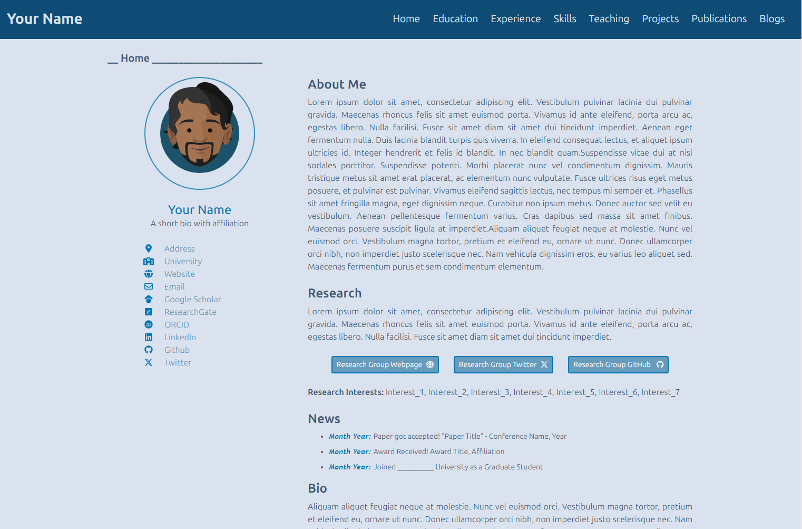
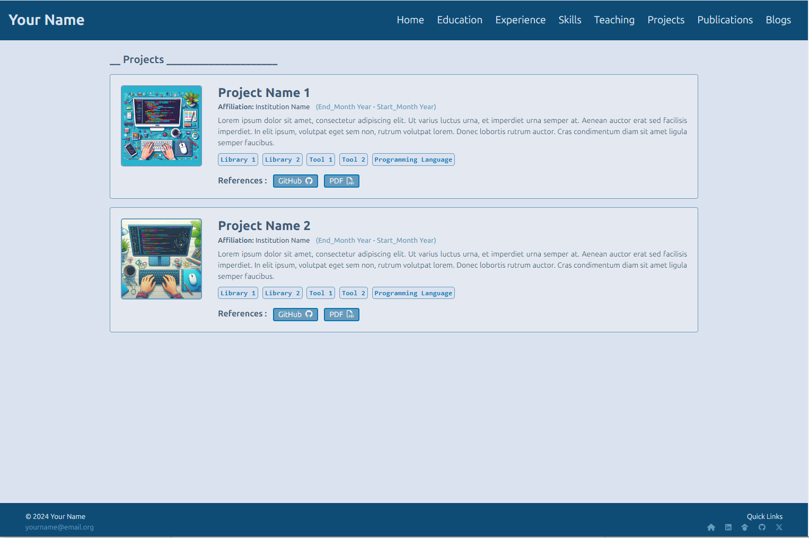
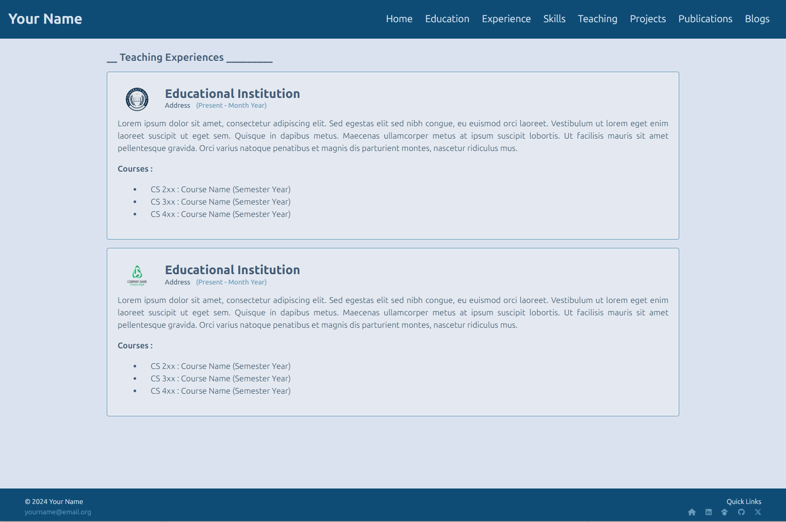
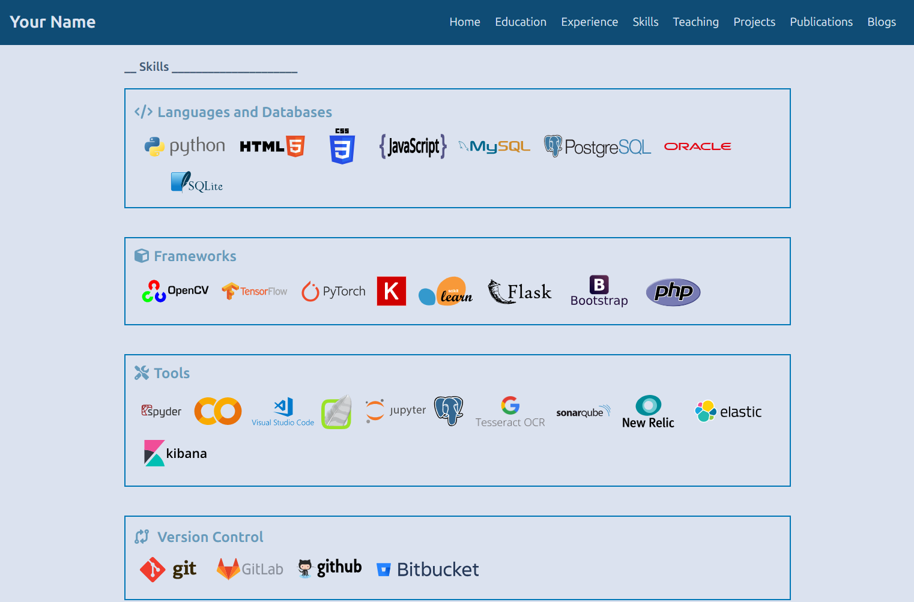
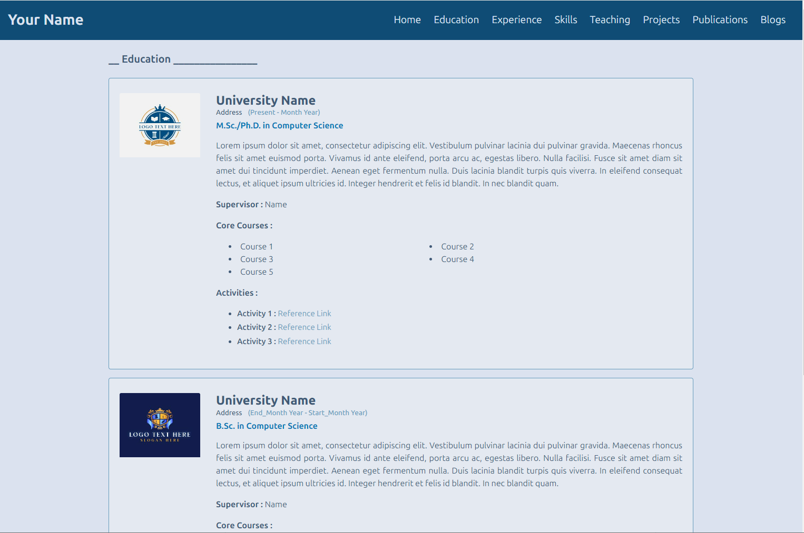
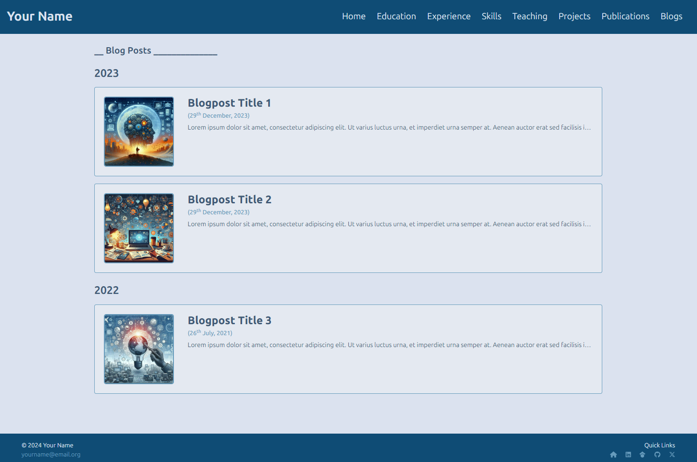
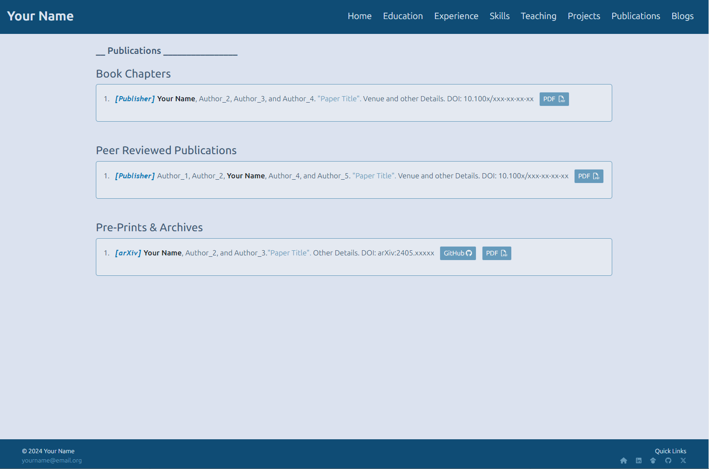

# academic-portfolio

This repository contains a personalized and responsive academic portfolio built with HTML, CSS, JavaScript, and Bootstrap. Designed for researchers, scholars, and students, this site showcases my academic background, research projects, publications, teaching experience, and professional skills in a clean and human-centered layout.

## Features

- **Mobile-Friendly Layout**: Designed to adapt across devices—desktop, tablet, and phone.
- **Built on Bootstrap 4**: Structured with familiar grid systems and UI components for ease of editing.
- **Clean Design**: Emphasis on readability and structure for academic visibility.
- **Modular Pages**: Easily add or remove sections (e.g., Projects, Teaching, Publications).
- **Straightforward Customization**: Basic HTML/CSS knowledge is enough to modify and expand.

## Sections

- **Home**: Welcome text and personal intro.
- **Education**: Degrees and core areas of academic formation.
- **Certifications**: Additional training, technical certificates, and online specializations.
- **Teaching**: Formal and informal teaching experiences across levels.
- **Projects**: Hands-on data science, system design, and AI projects.
- **Publications**: Peer-reviewed articles, conference papers, and working drafts.
- **Blog**: Personal reflections and insights on technology, theology, and ethics.
- **Contact**: Email and social media links.

## Screenshots
> ### Homepage  
> 

> ### Projects  
> 

> ### Teaching  
> 

> ### Skills & Education  
>  

> ### Blog & Publications  
>  

## How to View

1. **Clone this repository**
   ```bash
   git clone https://github.com/Temela/academic-portfolio.git
   ```

2. **Navigate into the project directory**
   ```bash
   cd academic-portfolio
   ```

3. **Launch the site**
   Open `index.html` in any browser. No server needed.

## Customization

- All HTML files are in the `/pages` directory.
- Stylesheets and images are inside `/assets`.
- Edit header and footer components in `/components/` for site-wide changes.
- All sections are self-contained, making it easy to remove or extend features.

---

This portfolio is maintained by **Fr. Anthony Nduka, C.S.Sp.**  
_Last updated: July 2025_
